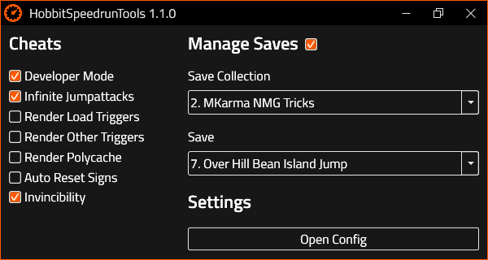

 

  

  <h2 align="center">Hobbit Save Manager</h2>

  

    <i>A tool for quickly swapping practice saves for speedrunners of The Hobbit</i>
     
    <a href="../../issues">Report Issue</a>
    -
    <a href="../../issues">Request Feature</a>
  

# Table of Contents

* [About](#about)
* [Features](#features)
* [Usage](#usage)
* [Download](#download)
* [Warning](#warning)

# About

This is a tool made to quickly swap saves in the 2003 PC game "The Hobbit". This is beneficial to speedrunners as they manage a lot of saves for practice and swapping between them is time consuming and tedious.

  

 

# Features
* Allows super fast swapping of saves
* Only keeps 1 save at all times, always making it the first option under "Load Game"
* Easily expandable with your own saves
* Backs up existing saves on startup and restores them on close

# Usage

Start the program, this will automatically back up and clear your saves folder. From there you can select a save collection that suits your needs. Then all that's left is to pick a save, this will then automatically become the only save in your game.

# Download

Download the most recent release [here](../../releases). Simply open the zip file and extract the full "hobbit-save-manager" folder the location where you want to keep it. Then you can run the hobbit-save-manager.exe file inside the folder, and you're up and running!

# Warning

Although Hobbit Save Manager is written to back up your old saves and restore them after use, I can't guarantee that this will always function as expected. Make sure to back up important saves yourself.